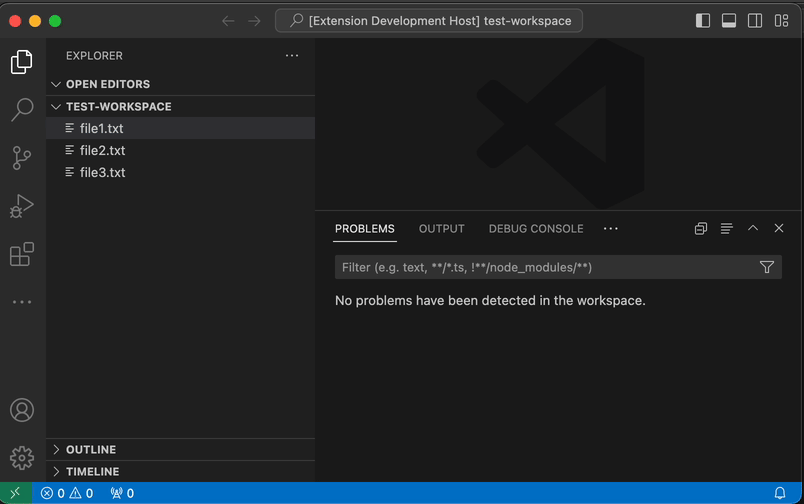

# vscode-bug-no-didClose

Sample project to reproduce an issue where `textDocument/didOpen` triggers for
files returned from "Find References", but no corresponding
`textDocument/didClose` triggers. The `didClose` event does not trigger even
after opening the file from the "References" pane and then closing it.

## Bug reproduction steps

1. Run `npm install`
2. Create a new workspace folder with some text files:
  ```sh
  mkdir /tmp/test-workspace
  echo "File 1" > /tmp/test-workspace/file1.txt
  echo "File 2" > /tmp/test-workspace/file2.txt
  echo "File 3" > /tmp/test-workspace/file3.txt
  ```
3. Run debug configuration "Launch Client"
4. Open the workspace folder created in step #2.
5. Open file `file1.txt`
6. Right-click the word `File` in `file1.txt` and "Find References". Notice the errors from `file2.txt` in the "Problems" pane
7. Opening `file2.txt` and then closing it will not remove the published diagnostics, nor does clearing it from the References results pane.
8. Closing the original `file1.txt` _will_ clear the diagnostics for this file.

See bug video here:


